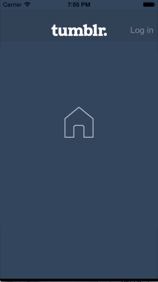

# Tumblr

This is Ryan Sims' Tumblr Demo App that demonstrates usage of custom transitions and animations.

Time spent: 8-9 hours spent in total

Completed user stories:
* &#10004; Tapping on Home, Search, Account, or Trending should show the respective screen and highlight the tab bar button.
* &#10004; Compose button should modally present the compose screen.
* &#10004; Optional: Compose screen is faded in while the buttons animate in.
* &#10004; Optional: Login button should show animate the login form over the view controller.
* &#10004; Optional: Discover bubble should bob up and down unless the SearchViewController is tapped.

Note:
Fun assignment!

Walkthrough of all user stories:

GIF created with [LiceCap](http://www.cockos.com/licecap/).

